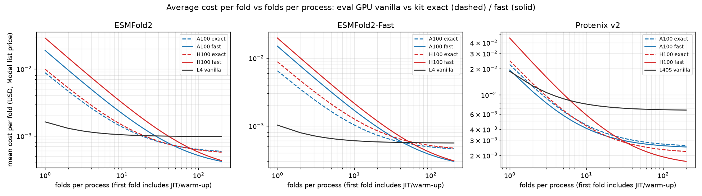

# Kit optimization modes (`optimization`)

ESMFold2 (including ESMFold2-Fast), Protenix, OpenDDE and RF3 accept a static init option
`optimization = "vanilla" | "exact"` (default `"vanilla"`). RF3 also accepts `"fast"` and `"big"`. #125 removed `fast` for
the other families after memory problems on A100, and boileroom still refuses it there; RF3's `fast` and `big` were run on
A100 and H100 over a range of input sizes before being offered (see [RF3](#rf3-fast-and-big-measured-2026-10-09)). The kit modes
drive the prebuilt kernels of
[anthropics/uplifting-biomolecular-modeling](https://github.com/anthropics/uplifting-biomolecular-modeling) (Apache-2.0, kit
commit `f4f62fa`).

- `vanilla`: unchanged behavior.
- `exact`: byte-identical to the unoptimized path when the kit's `--det 1` recipe is applied.
- `fast` (RF3 only): numerically different (bf16 re-association), within the model's seed-to-seed spread. For the other
  families it is not selectable; the tables below keep the numbers measured with it.
- `big` (RF3 only): the kit's fast kernels without CUDA graphs, plus memory optimizations. Slower than `fast`; the only mode
  measured to complete 2,608 and 3,260 residues on an A100-80GB (`fast` runs out of memory at 2,608; `exact` and vanilla were
  not tried that large).

A mode is all of its levers on a GPU class. The mode is resolved against the visible GPU before any
weights load, and a GPU or stack the kit cannot serve fails by name with `OptimizationUnavailableError`.

| GPU | class | `exact` / `fast` / `big` |
| --- | --- | --- |
| A100 | sm80 | served (kit config `a100`) |
| H100, H200 | sm90 | served (kit config `h100`; Modal may schedule an H100 request onto an H200) |
| L4, L40S | sm89 | refused by name (ESMFold2: kit levers need more shared memory or have no tile table; Protenix: no BLK2 launch cells; RF3: the kit serves A100 and H100/H200 only) |

## Requirements

The kit ships its own pinned stack, so the kit modes need a kit image, not the default boileroom image:

- ESMFold2: python 3.12, torch 2.13+cu130, esm 3.3.0 and the kit's transformers fork (`ESMFold2Model`),
  flash-attn / TransformerEngine built from source. Kit modes load the fork's model class and fold through
  `ESMFold2InputBuilder.fold()`, which the kit hooks; `vanilla` keeps loading esm's `EsmFold2Model`.
- Protenix: python 3.11, torch 2.13.0+cu130, cuequivariance 0.11.1, protenix 2.0.0, driver 580+.
  The kit is enabled inside the worker before any `protenix` import (the kit refuses late activation).
- OpenDDE: python 3.11, torch 2.7.1+cu126, cuequivariance 0.10.0, opendde 1.1.1, CUDA 12.6 `nvcc` and gcc at run time
  (Triton JIT), libstdc++ from GCC 13 for `exact`, driver 560+. Unlike the other two families it has no separate kit image: the
  stock `boileroom-opendde` image installs the pinned kit commit, and the kit is enabled in the worker before `runner` is imported.
- RF3: python 3.12, torch 2.13.0+cu130, cuequivariance 0.11.1, rc-foundry (RF3 `4010e3e`), driver 580+. The kit is enabled
  (`rosettafold3_opt.enable(<mode>, strict=True)`) before the first `rf3` import, in the kit image's patched interpreter
  `/kit/rosettafold3/opt/venv/bin/python`. `vanilla` runs in the stock `boileroom-rf3` image (torch 2.7.1+cu126,
  cuequivariance 0.10.0, `/opt/rf3` virtualenv), which the kit image does not replace.

For ESMFold2, Protenix and RF3 the repository carries the definition of that separate kit image, and `optimization="vanilla"` never
touches it:

| Family | Dockerfile | Image name | Base |
| --- | --- | --- | --- |
| ESMFold2 | [`boileroom/models/esmfold2/kit/Dockerfile`](../boileroom/models/esmfold2/kit/Dockerfile) (+ `kit_wheels.sh`, `kit_finish.sh`) | `boileroom-esmfold2-kit` | `python:3.12.10-slim-bookworm` |
| Protenix | [`boileroom/models/protenix/kit/Dockerfile`](../boileroom/models/protenix/kit/Dockerfile) | `boileroom-protenix-kit` | `nvidia/cuda:13.0.1-cudnn-devel-ubuntu24.04` |
| RF3 | [`boileroom/models/rf3/kit/Dockerfile`](../boileroom/models/rf3/kit/Dockerfile) | `boileroom-rf3-kit` | `nvidia/cuda:12.6.3-runtime-ubuntu22.04` (the kit's CUDA 13 stack is installed from wheels) |

Both Dockerfiles fetch the kit at the pinned commit `f4f62fa6592ae4938d49b1757bea0cfeff9f468e` and follow the kit's own
`<family>/environment/Dockerfile` at that commit: the same lock, versions, checksums and compile recipe. The changes are the
kit coming from git instead of a build context, the optional `_jitcache` `COPY` removed (a glob that Modal's Dockerfile parser
rejects), and boileroom's runtime dependencies on top (`fastapi`/`uvicorn` for the Apptainer service). These are the
definitions the benchmark images in [Measured](#measured-5-seeds-x-3-complexes-of-170-199-tokens-no-msa-bakeoff-sampler-settings)
were made from; the benchmark recipe itself lived outside the repository, so what is checked in is a reconstruction of it, not
the original files.

**Routing.** The wrapper picks the image from `optimization`: `vanilla` (the default) runs the stock `boileroom-esmfold2` /
`boileroom-protenix` / `boileroom-rf3` image and Modal class as before, and a kit mode (`exact`, or RF3's `fast` / `big`) runs `ModalESMFold2Kit` /
`ModalProtenixKit` / `ModalRF3Kit` (Modal) or the kit image (Apptainer). The kit classes live on their own Modal apps
(`boileroom-esmfold2-kit`, `boileroom-protenix-kit`, `boileroom-rf3-kit`), so using vanilla never builds a kit image. A kit
class asks for an A100 (ESMFold2 and RF3 `A100-80GB`, Protenix `A100-40GB`); pass `device="H100"` (or `H200`) to run on those.

**Where the image comes from.** `BOILEROOM_KIT_IMAGE_SOURCE` selects it:

- `build` (default): Modal builds the image from the Dockerfile in your installed boileroom. Nothing is published, so the first
  kit-mode use pays the build and Modal caches it afterwards. Protenix compiles its fast-LayerNorm extension, which takes
  minutes. ESMFold2 compiles flash-attn, TransformerEngine and xformers for compute capability 8.0 and 9.0 on a 48-core,
  192 GiB build step with a 4 h limit (the benchmarked image compiled in 1893 s on 64 cores; budget 30-45 min on Modal, more
  on a smaller builder).
- `registry`: Modal (or Apptainer, as `docker://`) pulls `<repository>/boileroom-<family>-kit:<tag>` for an image you built and
  pushed. The repository comes from `BOILEROOM_DOCKER_REPOSITORY` and the tag from `BOILEROOM_IMAGE_TAG`, as for the stock
  images. This repository's CI does not build the kit images (the ESMFold2 compile takes hours on a GitHub-hosted
  runner); they are built locally and pushed by hand. Both are on `docker.io/jakublala` as `boileroom-esmfold2-kit` and
  `boileroom-protenix-kit` under the temporary tag `sha-dc652b0`, to be retagged to the release version after merge.
  `boileroom-rf3-kit` is not published; use `build`, or build and push it as below.

Apptainer only pulls from a registry, so a kit mode on the Apptainer backend needs a published image: set
`BOILEROOM_KIT_IMAGE_SOURCE=registry` or pass `backend="apptainer:<tag>"`. Without either, boileroom refuses the call up
front instead of failing on a pull that cannot succeed.

To build an image yourself on a many-core machine and use it from Modal or Apptainer:

```bash
docker build -f boileroom/models/protenix/kit/Dockerfile boileroom/models/protenix/kit -t <repository>/boileroom-protenix-kit:<tag>
docker build -f boileroom/models/esmfold2/kit/Dockerfile boileroom/models/esmfold2/kit -t <repository>/boileroom-esmfold2-kit:<tag>
docker build -f boileroom/models/rf3/kit/Dockerfile boileroom/models/rf3/kit -t <repository>/boileroom-rf3-kit:<tag>
# H100/H200 only, a smaller ESMFold2 compile: add --build-arg STACK=img_ef2_fa
docker push <repository>/boileroom-esmfold2-kit:<tag>   # and likewise for protenix

export BOILEROOM_KIT_IMAGE_SOURCE=registry BOILEROOM_DOCKER_REPOSITORY=<repository> BOILEROOM_IMAGE_TAG=<tag>
```

The Modal `build` path produces the same image through the same scripts: the Dockerfile is built with `WHEELS_FROM=defer` and
the compile and install (`kit_wheels.sh`, `kit_finish.sh`) run as a Modal build step on the larger builder. The image
identity is the Dockerfile plus those scripts at the pinned kit commit.

**ESMFold2 weights.** The kit loads its own pinned Hugging Face snapshots (`biohub/ESMFold2`, `ESMFold2-Fast`, `ESMC-6B`, about
27 GB), which differ from the single revision (`ESMFOLD2_HF_REVISION`) that `vanilla` loads. They are not in the image. On the
first kit-mode call the core downloads the snapshots for the requested variant into `$MODEL_DIR/esmfold2/kit-hf` (on Modal, the
`model_weights` volume) and reuses them afterwards; a failed download raises `OptimizationUnavailableError`. Protenix keeps
downloading its checkpoint into `PROTENIX_ROOT_DIR`, as in vanilla. RF3 uses the same checkpoint (`rf3_foundry_01_24`, sha256-verified,
downloaded into `$MODEL_DIR/rf3` on first use) in every mode; the kit changes the kernels, not the weights.

**What has been exercised.** The Dockerfiles, routing, builders, the Apptainer interpreter selection and the weight bootstrap
are covered by offline contract and unit tests (`tests/contracts/test_kit_images.py`, the kit tests in
`tests/esmfold2/test_esmfold2.py`). On Modal, through this repository's routing and images built from the Dockerfiles here
(2026-10-03; `PredictionMetadata.optimization` reported the requested and resolved mode, kit config and card each time):

| Model | Mode and card | Cold first fold | Warm fold |
| --- | --- | --- | --- |
| ESMFold2 | `fast` A100, `exact` A100, `fast` H100 | 98 s, 74 s, 166 s | 0.4 s, 0.5 s, 0.4 s (vanilla A100: 1.9 s) |
| Protenix | `fast` A100 and H100, `exact` A100 and H100, `fast` with a template (A100) | 65-208 s | `fast` 4.9 s A100 / 4.3 s H100, `exact` 3.1 s A100 / 2.3 s H100 (vanilla A100: 5.5 s) |
| OpenDDE | `exact` and `fast` A100 | 45 s, 62 s | 4.5 s, 4.3 s (vanilla: 7.0 s, 15 folds) |
| RF3 | `exact`, `fast` and `big` on A100-80GB, A100-40GB and H100 (2026-10-09) | see [RF3](#rf3-fast-and-big-measured-2026-10-09) | see [RF3](#rf3-fast-and-big-measured-2026-10-09) |

The `fast` rows for ESMFold2, Protenix and OpenDDE predate #125 and cannot be reproduced through boileroom today (the wrapper
refuses `fast` for those families). The cold fold includes the model load (plus the one-off weight download the first time on a
volume). ESMFold2 `fast` on A100 gave ptm 0.173 against vanilla's 0.176 for the same sequence. OpenDDE `exact` and `fast` differ
from vanilla by up to several angstroms of C-alpha RMSD at the same seed on two-chain complexes, but two same-seed runs of
vanilla differ by 0.8-2.3 A, so
this is the sampler's run-to-run variation, not evidence the kit is wrong; `exact` is the more repeatable (0.5 A between runs).
Do not rely on bit-identical output to vanilla for OpenDDE.

Not exercised: the Apptainer kit path (also for RF3, whose kit image carries `fastapi`/`uvicorn` in the system interpreter but was
never started under Apptainer), `kit_msa` for ESMFold2, a Protenix, OpenDDE or RF3 kit fold with a caller-supplied MSA, and
OpenDDE on H100. The benchmark numbers below were measured on images assembled from the original recipe. The Protenix
Dockerfile keeps `TORCH_CUDA_ARCH_LIST="9.0+PTX"` from that recipe, whose configured card was the H100; the A100 runs above
completed, but whether stock's fast-LayerNorm extension (built for compute capability 9.0) is used on an A100 or falls back was
not checked.

**ESMFold2 loads offline.** After the weight bootstrap the core sets `HF_HUB_OFFLINE` / `TRANSFORMERS_OFFLINE`, as the kit's
own launcher does. Online, `from_pretrained("biohub/ESMFold2")` would resolve upstream's newest commit, which this kit's
transformers fork cannot parse, and repoint the volume's `refs/main` at it. The kit's pinned `ccd.pkl` is read from the same
snapshot directory.

`PredictionMetadata.optimization` records the requested and resolved mode, kit config and GPU.

## RF3: `fast` and `big` (measured 2026-10-09)

RF3 accepts `optimization = "vanilla" | "exact" | "fast" | "big"`. `fast` is the kit's default mode and `big` its
memory-saving mode; both run in the kit image next to `exact`, on A100 and H100/H200 only. They were run on the cards RF3 is
served on, over inputs of 326 to 3,260 residues, before being offered, because #125 withdrew `fast` for the other families
after memory problems on A100. Every number below comes from Modal runs through this repository's routing with images built
from the Dockerfiles here; no RF3 image is published.

Setup: T4 lysozyme (163 residues) repeated as 2-16 chains, no MSA, the defaults (10 recycles, 50 steps, 5 samples), `seed=0`.
"Warm" is the second call of the same shape in one worker; the first call of a shape pays model load and per-shape kernel
setup (up to 27 s more, and the kit documents per-shape costs). The kit modes record the card they ran on in
`PredictionMetadata.optimization["gpu_name"]`; vanilla does not, so the vanilla columns show the requested card.

Warm seconds per fold:

| Residues | A100-80GB vanilla | `exact` | `fast` | `big` | H100 vanilla | `exact` | `fast` | `big` |
| --- | --- | --- | --- | --- | --- | --- | --- | --- |
| 326 | 18.8 | 11.2 | 17.0 | 15.5 | 16.8 | 11.1 | 10.8 | 13.8 |
| 652 | 42.6 | 27.5 | 30.6 | 33.4 | 32.3 | 22.7 | 17.8 | 22.5 |
| 978 | 85.6 | 55.2 | 55.1 | 58.5 | 61.1 | 42.6 | 28.4 | 38.7 |
| 1,304 | 149.6 | 93.5 | 85.3 | 101.1 | 101.7 | 70.6 | 46.2 | 69.7 |
| 1,630 | 264.3 | 154.4 | 127.6 | 186.0 | 171.2 | 112.7 | 62.7 | 119.1 |

`fast` is not a universal speedup. On A100 it is slower than `exact` up to about 650 residues, equal at about 1,000, and 1.1x and
1.2x faster at 1,304 and 1,630 residues. On H100 it matches `exact` at 326 residues and is 1.3-1.8x faster from 652 residues
up. Against vanilla, `fast` at 1,630 residues is 2.1x faster on A100-80GB and 2.7x on H100 (at Modal list prices, $0.089 and
$0.069 per fold against $0.183 for vanilla on A100-80GB). For small inputs on A100 `exact` is the better choice; `big`
trades speed for memory and is never the fastest.

Memory (completed, or the first size that ran out of memory; larger sizes were not tried unless stated):

| Card | `exact` | `fast` | `big` |
| --- | --- | --- | --- |
| A100-40GB | completes 652; out of memory at 978 | completes 1,304 | completes 1,304 |
| A100-80GB | completes 1,630 | completes 1,956 (198 s, one cold call); out of memory at 2,608 (a 12.9 GiB allocation with 7.7 GiB free) | completes 1,956 (364 s), 2,608 (649 s) and 3,260 (1,135 s), one cold call each |
| H100 | completes 1,630 | completes 1,630 | completes 1,630 |

The memory problem #125 reported for `fast` on A100 did not reproduce up to 1,956 residues on A100-80GB or 1,304 on A100-40GB; on
A100-40GB `exact` runs out first (stock's triangle-attention fallback), and `fast` fits where `exact` does not. Beyond that,
`fast` runs out of memory before `big` does. `RF3Core` re-raises a CUDA out-of-memory from a `fast` fold with a message naming
`optimization='big'`; it does not retry on its own.

Agreement with stock `rf3 fold` (A100-80GB, C-alpha RMSD in angstroms after superposition, against the seed-0 reference in
`tests/data/rf3/manifest.json`; other seeds are compared with the same seed-0 reference, so they include the sampler's own
seed-to-seed spread):

| Mode | 1UBQ, seed 0 | 2ZTA (GCN4 dimer), seed 0 | worst over seeds 0-7, 1UBQ / 2ZTA |
| --- | --- | --- | --- |
| vanilla | 0.19 | 0.34 | 0.73 / 2.69 |
| `exact` | 0.71 | 0.39 | 0.90 / 0.41 |
| `fast` | 0.84 | 0.40 | 0.90 / 1.88 |
| `big` (seeds 0-2 only) | 0.80 | 0.38 | 0.89 / 0.38 |

ptm, ipTM and ranking score stay within 1e-3 of the reference in all but a few 1UBQ runs at other seeds (4.3-4.7e-3, with a PAE
mean absolute error of 0.12-0.13 A against 0.01-0.03 A elsewhere): vanilla seeds 3 and 7, `fast` seed 5 and `big` seed 1, so
this is the sampler's spread and not the kit. As the worker runs `python -I`, which ignores
`PYTHONHASHSEED`, `exact` is checked by tolerance and not bit-for-bit against vanilla. The kit modes report
`optimization={'requested': ..., 'active': ..., 'kit_config': 'a100' | 'h100', 'gpu_name': ...}`.

**Check the card before quoting a timing.** When several wrappers with different `device`s were alive in one Python process,
some folds were served from a different card than the one requested (A100-labelled folds ran on H100, and the reverse); the
cause was not confirmed, and one wrapper at a time, or one process per card, ran on the requested card. The tables above were
re-run that way or filtered on the recorded `gpu_name`, and the kit integration tests assert it.

Not measured: inputs between 1,956 and 2,608 residues on `fast` (where it starts to run out of memory), `exact` and vanilla above 1,630
residues, A100-40GB above 1,304, and any kit mode with a user MSA or on the Apptainer backend.

## Measured (5 seeds x 3 complexes of 170-199 tokens, no MSA, bakeoff sampler settings)

The `fast` columns below were measured before #125 withdrew `fast` for ESMFold2, Protenix and OpenDDE: they are history, not
an option boileroom still accepts for those families. The `exact` columns apply as measured.

Median warm wall seconds per fold through `ESMFold2Core` / `ProtenixCore` on Modal (wall includes pre- and
post-processing; the first fold of each process is excluded), and cost per fold at Modal list prices
(L4 $0.000222/s, L40S $0.000542/s, A100-80GB $0.000694/s, H100 $0.001097/s, H200 $0.001261/s).
The A100 runs landed on a mix of SXM4 and PCIe cards; the H100 rows are pinned real H100s (`H100!`).

| Model | Eval GPU, vanilla | A100 `fast` | H100 `fast` | H200 `fast` |
| --- | --- | --- | --- | --- |
| ESMFold2 (full) | L4: 4.40 s, $0.00098 | 0.47 s, $0.00032 | 0.26 s, $0.00029 | 0.23 s, $0.00028 |
| ESMFold2-Fast | L4: 2.51 s, $0.00056 | 0.33 s, $0.00023 | 0.19 s, $0.00021 | not run |
| Protenix v2 | L40S: 12.2 s, $0.0066 | 3.5 s, $0.0024 | 1.4 s, $0.0015 | not run |

Same GPU, vanilla vs kit (median warm wall time per fold and cost; speedup equals cost ratio because the GPU is the same):

| Model | GPU | vanilla | `exact` | `fast` |
| --- | --- | --- | --- | --- |
| ESMFold2 (full) | A100 | 2.04 s, $0.00141 | 0.79 s, $0.00055 (2.6x) | 0.47 s, $0.00032 (4.4x) |
| ESMFold2 (full) | H100 | 1.43 s, $0.00157 | 0.48 s, $0.00053 (3.0x) | 0.26 s, $0.00029 (5.5x) |
| ESMFold2-Fast | A100 | 1.51 s, $0.00105 | 0.62 s, $0.00043 (2.5x) | 0.33 s, $0.00023 (4.6x) |
| ESMFold2-Fast | H100 | 0.79 s, $0.00087 | 0.39 s, $0.00043 (2.0x) | 0.19 s, $0.00021 (4.2x) |
| Protenix v2 | A100 | 14.5 s, $0.0100 | 3.6 s, $0.0025 (4.0x) | 3.5 s, $0.0024 (4.1x) |
| Protenix v2 | H100 | 12.4 s, $0.0136 | 1.9 s, $0.0021 (6.4x) | 1.4 s, $0.0015 (9.1x) |
| OpenDDE | A100 | 16.1 s, $0.0111 | 12.7 s, $0.0088 (1.3x) | 9.3 s, $0.0064 (1.7x) |
| OpenDDE | H100 | 14.0 s, $0.0154 | 11.4 s, $0.0125 (1.2x) | 5.8 s, $0.0064 (2.4x) |

RF3 is not in this table: its inputs, settings and timings differ (see [RF3](#rf3-fast-and-big-measured-2026-10-09)).

OpenDDE rows use the same 3 complexes but boileroom's default sampler settings (10 cycles, 200 steps, 5 samples per
seed, A100-80GB SXM4 / H100), so their absolute seconds are not comparable with the Protenix rows above, which used the
bakeoff's lighter settings. The first fold of a process takes 61-78 s in every mode (weight load, plus Triton JIT and CUDA
graph capture for the kit modes), and the kit modes add only 3-5 s to it, so they pay off from the second fold.
The OpenDDE image sets `LAYERNORM_TYPE=fast_layernorm` but does not install `ninja`, so upstream's fused LayerNorm CUDA
extension cannot be built (the worker logs "Fast LayerNorm CUDA extension is unavailable ... Ninja is required") and all
three modes use torch's `layer_norm`; installing ninja is the first thing to try for a further speed-up and would change
these numbers.

OpenDDE `exact` is not reproducible against vanilla at these settings: aligned RMSD of the same seed between vanilla and
`exact` has a median of 0.6-2.1 A and reaches 9-13 A on the flexible ubiquitin-barnase complex. This is not a kit
regression: two vanilla repeats of one seed already differ by up to 10 A and two `exact` repeats by up to 3.5 A,
because boileroom does not enable the runner's deterministic mode; the kit documents bit-identity only with
`--det 1`. Treat all modes as stochastic samplers until a `deterministic` option is added and re-measured.

Vanilla on A100/H100 costs more per fold than vanilla on the eval GPUs (L4 $0.00098 / $0.00056 for ESMFold2 / ESMFold2-Fast, L40S $0.0066 for Protenix), so the kit is what makes those GPUs worth using. A100 rows mix cards (ESMFold2-Fast and Protenix vanilla/exact on SXM4, `fast` on PCIe; full ESMFold2 vanilla/fast on PCIe, `exact` on SXM4), so A100 ratios carry a few percent of hardware noise.

`exact` (bit-identical with `--det 1`) lowers warm cost per fold by 1.8x for full ESMFold2 (H100: 0.48 s,
$0.00053), 1.3x for ESMFold2-Fast and 2.6-3.1x for Protenix, against the eval-GPU vanilla.

The kit pays a one-time warm-up on the first fold of a process (Triton JIT, CUDA graphs: 18-41 s for `fast`,
8-32 s for `exact`), so it only lowers cost for containers that stay warm. Against the eval GPU running
vanilla, `fast` on A100/H100 breaks even after about 28-41 folds per process for full ESMFold2, 44-55 for
ESMFold2-Fast and 2-7 for Protenix (no persistent `MODEL_OPT_JIT_ROOT`; a persistent cache was not measured).



Raw numbers: [`optimization-bench/summary.json`](optimization-bench/summary.json).
